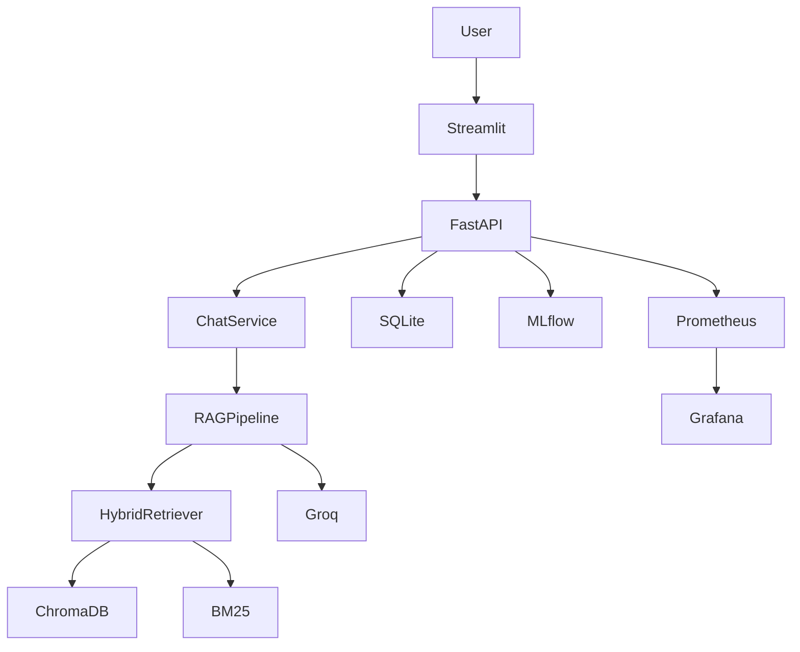

# Enterprise LLMOps RAG Platform

## Overview

## Features

## Architecture

## Tech Stack

## Project Structure

## Quick Start

## Configuration

## API Endpoints

## Screenshots

## Monitoring

## Evaluation

## CI/CD

## Deployment

## Future Improvements

## License

# Architecture Diagram (Mermaid)

